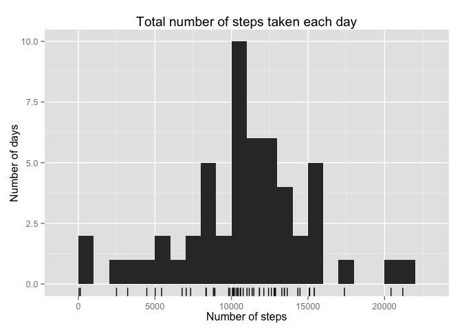
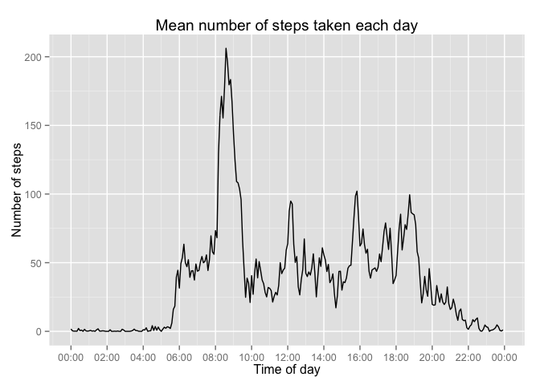
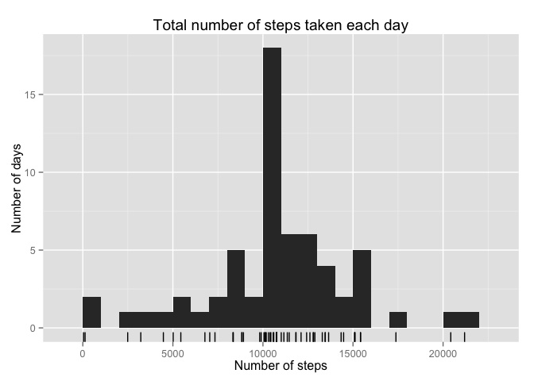
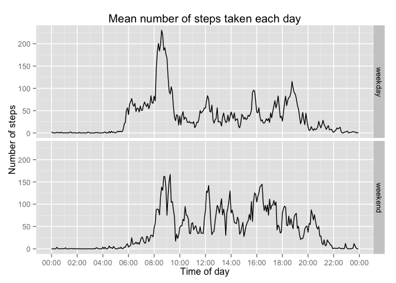

# Reproducible Research: Peer Assessment 1


## Loading and preprocessing the data
Let's unzip the ZIP file into current directory and load the data.

```r
unzip("activity.zip")
activity <- read.csv("activity.csv",
                     colClasses=c("integer", "Date", "integer"))
```

## What is mean total number of steps taken per day?
We start the analysis by plotting an histogram of the number of steps by days. We will probably have a warning because of NAs.

```r
library(dplyr)
library(scales)
library(ggplot2)

steps.by.day <- group_by(activity, date) %>%
  summarize(steps=sum(steps))

qplot(steps, data=steps.by.day, binwidth=1000) +
  xlab("Number of steps") +
  ylab("Number of days") +
  ggtitle("Total number of steps taken each day") +
  geom_rug()
```

 

Let's glance at the mean and median values of the number of steps by day. They are surprisingly close.

```r
mean(steps.by.day$steps, na.rm=TRUE)
```

```
## [1] 10766.19
```

```r
median(steps.by.day$steps, na.rm=TRUE)
```

```
## [1] 10765
```

## What is the average daily activity pattern?

```r
steps.by.interval <- group_by(activity, interval) %>%
  summarize(steps=mean(steps, na.rm=TRUE)) %>%
  mutate(time=ISOdate(2015, 4, 20, floor(interval / 100), interval %% 100))
# Added a random date (actually the assignement due date) with the time
# corresponding to the interval. Will make a nicer plot ;)

qplot(time, steps, data=steps.by.interval, geom="line") +
  scale_x_datetime(labels=date_format("%H:%M"), breaks="2 hours") +
  xlab("Time of day") +
  ylab("Number of steps") +
  ggtitle("Mean number of steps taken each day")
```

 

Well this looks OK. There are a few occasional steps between 11PM and 5AM, but otherwise it looks like a good nap time.

Now let's find the most active interval that looks like it's around 8:30.

```r
filter(steps.by.interval, steps==max(steps)) %>% select(-time)
```

```
## Source: local data frame [1 x 2]
## 
##   interval    steps
## 1      835 206.1698
```

And it is the interval from 8:35 to 8:40 indeed, with an average of a bit more than 200 steps.

## Imputing missing values
How many missing values in the dataset ?

```r
sum(is.na(activity$steps))
```

```
## [1] 2304
```

```r
nrow(activity)
```

```
## [1] 17568
```

```r
sum(is.na(activity$steps)) / nrow(activity)
```

```
## [1] 0.1311475
```

There are 2304 missing values, out of 17,568. That is about 13%.

Let's remplace NAs with mean for the corresponding 5 minutes interval.

```r
activity.imputed <- group_by(activity, interval) %>%
  mutate(steps=ifelse(is.na(steps), mean(steps, na.rm=TRUE), steps)) %>%
  ungroup

steps.by.day.imputed <- group_by(activity.imputed, date) %>%
  summarize(steps=sum(steps))

qplot(steps, data=steps.by.day.imputed, binwidth=1000) +
  xlab("Number of steps") +
  ylab("Number of days") +
  ggtitle("Total number of steps taken each day") +
  geom_rug()
```

 

The histogram doesn't show a huge change. The peak is higher, but that's about it.
What about mean and median?


```r
mean(steps.by.day.imputed$steps)
```

```
## [1] 10766.19
```

```r
median(steps.by.day.imputed$steps)
```

```
## [1] 10766.19
```

So, with our imputation algorithm, basically there is no change whether you replace the NAs or not.

## Are there differences in activity patterns between weekdays and weekends?

```r
# It's probably better to use the POSIXlt $wday than the weekdays method
# to avoid locale issues
activity.imputed$weekday <- ifelse(
  strptime(activity.imputed$date, "%F")$wday %in% 1:5, "weekday", "weekend")

steps.by.interval.imputed <- group_by(activity.imputed, interval, weekday) %>%
  summarize(steps=mean(steps, na.rm=TRUE)) %>%
  mutate(time=ISOdate(2015, 4, 20, floor(interval / 100), interval %% 100))
# Added a random date (actually the assignement due date) with the time
# corresponding to the interval. Will make a nicer plot ;)
# Maybe not the nicest hack, but it's working OK.

qplot(time, steps, data=steps.by.interval.imputed, geom="line") +
  scale_x_datetime(labels=date_format("%H:%M"), breaks="2 hours") +
  facet_grid(weekday ~ .) +
  xlab("Time of day") +
  ylab("Number of steps") +
  ggtitle("Mean number of steps taken each day")
```

 

Seems I'm not the only to wake up later on weekends ;)
The weekends look at first less active (peaks are lower), but the time range between 12:00 and 18:00 shows a different pattern. Let's try to count the number of steps.


```r
group_by(steps.by.interval.imputed, weekday) %>% summarize(steps=sum(steps))
```

```
## Source: local data frame [2 x 2]
## 
##   weekday    steps
## 1 weekday 10255.85
## 2 weekend 12201.52
```

```r
12201.52 / 10255.85
```

```
## [1] 1.189713
```

That almost 20% more steps on weekends... Doing some sports?
